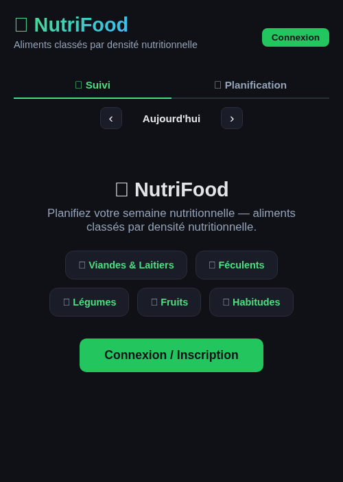
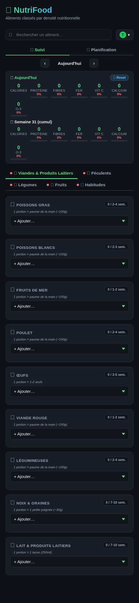
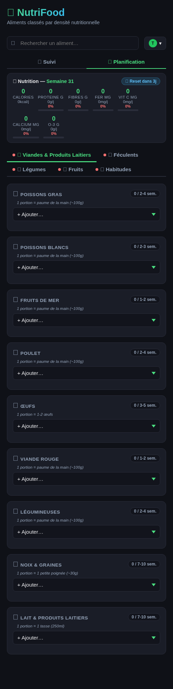
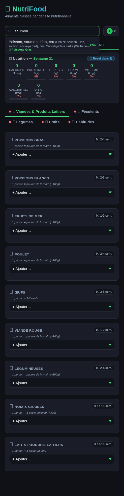
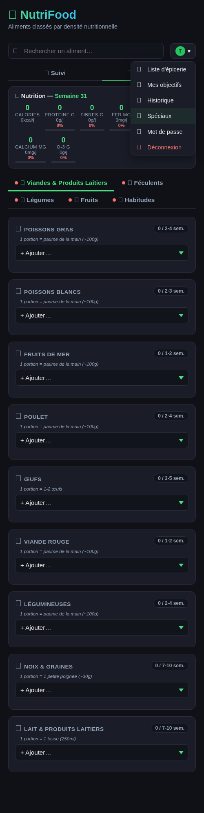
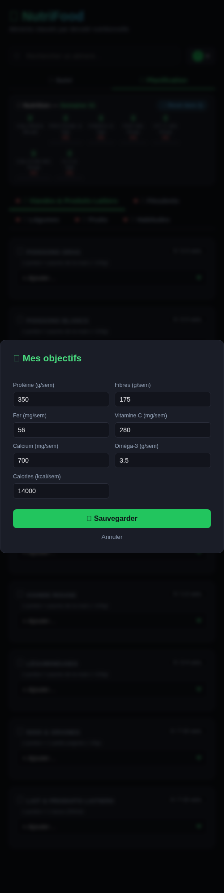
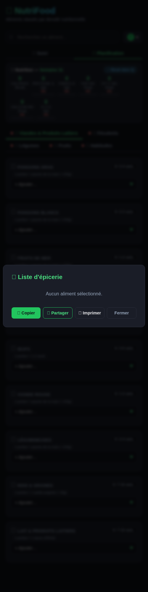

# 🍎 NutriFood

App de planification de repas et suivi nutritionnel basée sur le Guide alimentaire canadien.

## 📑 Table des matières

- [Fonctionnalités](#fonctionnalités)
  - [Planification hebdomadaire](#planification-hebdomadaire)
  - [Suivi quotidien (tracking)](#suivi-quotidien-tracking)
  - [Spéciaux (deals hebdomadaires)](#spéciaux-deals-hebdomadaires)
- [Architecture](#architecture)
  - [Stack](#stack)
  - [Modules frontend](#modules-frontend)
  - [Docker](#docker)
  - [Données persistantes](#données-persistantes)
  - [Schéma DB](#schéma-db)
- [Système de deals (epiceries.ca)](#système-de-deals-epiceriesca)
- [API Endpoints](#api-endpoints)
- [Sécurité](#sécurité)
- [Installation](#installation)
- [Données nutritionnelles](#données-nutritionnelles)
- [Licence](#licence)

## 📖 Documentation

| Guide | Description |
|-------|-------------|
| [📖 Guide utilisateur](docs/USER_GUIDE.md) | Comment utiliser NutriFood : comptes, navigation, sélection, recherche, objectifs, listes d'épicerie, reset |
| [🚀 Guide de déploiement](docs/DEPLOYMENT.md) | Installation complète : Docker, configuration, reverse proxy, Cloudflare, sauvegardes |
| [🔧 Guide administrateur](docs/ADMIN_GUIDE.md) | Gestion des aliments, utilisateurs, DB, logs, maintenance |
| [📊 Rapport QA](docs/QA_REPORT.md) | Résultats Lighthouse, OWASP ZAP, SonarQube (31 juillet 2025) |

### Aperçu

| | | |
|---|---|---|
|  |  |  |
| *Page d'accueil* | *Mode Suivi* | *Mode Planification* |
|  |  |  |
| *Recherche* | *Spéciaux d'épicerie* | *Objectifs nutritionnels* |
|  | | |
| *Liste d'épicerie* | | |

---

## Fonctionnalités

### Planification hebdomadaire

> 📖 Voir : [Guide utilisateur — Sélectionner des aliments](docs/USER_GUIDE.md#🖱️-sélectionner-des-aliments)

- Sélection d'aliments par catégorie (protéines, légumes, fruits, grains, etc.)
- Calcul automatique des objectifs nutritionnels (protéines, fibres, fer, vitamine C, calcium, oméga-3, calories)
- Objectifs personnalisables par semaine → [Guide utilisateur — Objectifs](docs/USER_GUIDE.md#🎯-objectifs-nutritionnels-personnalisés)
- Liste d'épicerie générée à partir des sélections → [Guide utilisateur — Liste d'épicerie](docs/USER_GUIDE.md#🛒-liste-dépicerie)
- Suggestions de portions et carences en nutriments
- Sauvegarde automatique et historique des semaines
- Réinitialisation rapide (badge 🔄 cliquable) → [Guide utilisateur — Reset](docs/USER_GUIDE.md#🔄-réinitialiser-les-données)

### Suivi quotidien (tracking)

> 📖 Voir : [Guide utilisateur — Les deux modes](docs/USER_GUIDE.md#📊-les-deux-modes--suivi-et-planification)

- Onglet "Suivi" (par défaut) pour enregistrer ce que vous mangez réellement
- Navigation par jour (‹ ›) pour consulter l'historique
- Dashboard double : totaux du jour (instantané) + cumul de la semaine (API)
- Données préservées entre les deux modes (planification ↔ suivi)
- Mode mémorisé dans localStorage
- Réinitialisation : badge 🔄 cliquable → jour ou semaine complète

### Spéciaux (deals hebdomadaires)

- Liste des spéciaux d'épiceries.ca regroupés par catégorie
- Classés du meilleur rabais (prix unitaire le plus bas)
- Logos des chaînes (IGA, Metro, Super C, Maxi, Provigo, Walmart)
- Bouton "+" pour ajouter directement à la sélection
- Clic sur une ligne → fiche produit sur le site du marchand
- Tooltips au survol : nom complet du produit, magasin, format/prix/rabais

---

## Architecture

### Stack

- **Frontend:** HTML/CSS/JS vanilla (14 modules avec lazy loading)
- **Backend:** Python Flask (API REST, ~1770 lignes)
- **DB:** SQLite (nutrifood.db) avec tables FTS5 pour la recherche
- **Déploiement:** Docker Compose (2 conteneurs)

> 📖 Voir : [Guide de déploiement](docs/DEPLOYMENT.md)

### Modules frontend

| Module | Rôle |
|--------|------|
| `core.js` | Config API, état global, helpers DOM, loader de scripts (lazy loading) |
| `app.js` | Point d'entrée, init, restauration de session, orchestration |
| `auth.js` | Connexion, inscription, JWT, menu utilisateur, mot de passe oublié |
| `render.js` | Rendu des sections, catégories, chips, filtres, event delegation |
| `nutrition.js` | Totaux nutritionnels, objectifs, dashboard suivi, reset confirmation |
| `tracking.js` | Mode Suivi : switch onglets, chargement/sauvegarde par jour |
| `search.js` | Recherche normalisée (accents, ligatures) avec résultats en direct |
| `deals.js` | Spéciaux d'épicerie (epiceries.ca), badges, modal comparatif |
| `suggestions.js` | Suggestions automatiques basées sur carences nutritionnelles |
| `grocery.js` | Génération, partage et impression de la liste d'épicerie |
| `food-modal.js` | Fiche détaillée d'un aliment (tooltips, info-bulles) |
| `history.js` | Historique des snapshots hebdomadaires |
| `share.js` | Vue partagée en lecture seule (lien public) |
| `cnf.js` | Recherche dans la base CNF (5993 aliments de Santé Canada) |

### Docker

> 📖 Voir : [Guide de déploiement — Démarrer les conteneurs](docs/DEPLOYMENT.md#🐳-étape-3--démarrer-les-conteneurs)

Architecture 2 conteneurs :

```
nutrifood-api   (Flask/Gunicorn, port 5000 interne)
nutrifood-web   (Nginx, port 5011 hôte → proxy vers API)
```

Le frontend est servi par le conteneur nginx (nutrifood-web) qui proxy les requêtes `/api/` vers le backend (nutrifood-api).

### Données persistantes

> 📖 Voir : [Guide de déploiement — Structure de déploiement](docs/DEPLOYMENT.md#📁-structure-de-déploiement)

Volumes Docker :
- `./data:/data` — `nutrifood.db`, `deals_raw.json`
- `./config:/usr/share/nginx/html` — fichiers frontend (index.html, js/)

### Schéma DB

> 📖 Voir : [Guide administrateur — Structure de la base de données](docs/ADMIN_GUIDE.md#🗄️-structure-de-la-base-de-données)

| Table | Description |
|-------|-------------|
| `users` | Comptes utilisateurs (email, password_hash, is_admin, token_version) |
| `selections` | Planification hebdomadaire par utilisateur |
| `tracking` | Suivi quotidien (user_id, date, data JSON) |
| `history_snapshots` | Snapshots des semaines passées |
| `user_goals` | Objectifs nutritionnels personnalisés |
| `nf_sections` / `nf_categories` / `nf_foods` | Structure des aliments (source: SQLite) |
| `food` / `food_group` / `nutrient_name` / `nutrient_amount` | Base CNF (Santé Canada) |
| `food_search` (FTS5) | Index de recherche full-text |
| `share_links` | Liens de partage (avec expiration) |
| `reset_tokens` | Tokens de réinitialisation mot de passe (magic links) |
| `meal_plans` | Plans de repas hebdomadaires |
| `journal_entries` | Entrées de journal nutritionnel |

---

## Système de deals (epiceries.ca)

### Architecture en 3 couches

1. **`/data/deals_raw.json`** (source de vérité)
   - Fetch brut depuis epiceries.ca, une fois par semaine
   - Stocke TOUS les résultats sans filtrage
   - **JAMAIS modifié** après écriture (sauf refresh hebdomadaire)

2. **`filter_deals(raw, foods)` (pure function)**
   - Lit le raw, applique les filtres, retourne les deals valides
   - Aucun side effect — le raw reste intact
   - Filtres: word-boundary matching, exclusion animaux, strict match pour herbes/épices/noix

3. **API `/api/deals`**
   - Sert les deals filtrés en temps réel
   - Déclenche un refresh auto si le raw a >1 semaine
   - Le bouton "🔄 Rafraîchir" (admin) force un refresh manuel

---

## API Endpoints

> 📖 Voir : [Guide administrateur — Gérer les aliments](docs/ADMIN_GUIDE.md#✏️-gérer-les-aliments) pour les endpoints admin

### Aliments
- `GET /api/foods` — liste des catégories et aliments
- `GET /api/seasonal` — aliments de saison (mois courant)

### Recherche CNF
- `GET /api/cnf/search?q=...` — recherche dans la base CNF
- `GET /api/cnf/product/<id>` — fiche détaillée d'un aliment CNF

### Authentification
- `POST /api/register` — inscription
- `POST /api/login` — connexion (retourne JWT)
- `GET /api/me` — profil utilisateur courant
- `POST /api/change-password` — changement de mot de passe
- `POST /api/forgot-password` — mot de passe oublié (envoi lien)
- `POST /api/reset-password` — réinitialisation via magic link

### Planification
- `GET /api/selections` — sélections de l'utilisateur
- `POST /api/selections` — sauvegarder les sélections
- `GET /api/history` — historique des semaines
- `GET /api/history/<week>` — détail d'une semaine
- `GET /api/nutrition-summary` — résumé nutritionnel

### Suivi (tracking)
- `GET /api/tracking/<date>` — sélections du jour
- `POST /api/tracking/<date>` — sauvegarder le jour
- `DELETE /api/tracking/<date>` — effacer les données du jour
- `GET /api/tracking/week` — toutes les entrées de la semaine
- `DELETE /api/tracking/week` — effacer toute la semaine (lundi→dimanche)
- `GET /api/tracking/nutrition/<date>` — totaux nutritionnels (jour + semaine cumulée)

### Objectifs
- `GET /api/goals` — objectifs nutritionnels
- `POST /api/goals` — mettre à jour les objectifs

### Spéciaux (deals)
- `GET /api/deals` — spéciaux filtrés (lus depuis deals_raw.json, filtrés à la volée)
- `POST /api/deals/refresh` — forcer un refresh du raw (admin only)

### Autres
- `GET /api/suggestions` — suggestions basées sur carences
- `POST /api/share` — générer un lien de partage (avec expiration)
- `GET /api/shared/<token>` — vue partagée (lecture seule)
- `GET/POST /api/meal-plan` — plan de repas hebdomadaire
- `GET/POST/DELETE /api/journal` — journal nutritionnel
- `GET /api/journal/summary` — résumé du journal
- `GET /api/health` — health check

### Administration
- `POST /api/admin/food/hide` — masquer un aliment (admin only)
- `POST /api/admin/food/show` — afficher un aliment (admin only)

---

## Sécurité

### Headers de sécurité (nginx)
- `X-Content-Type-Options: nosniff`
- `X-Frame-Options: SAMEORIGIN`
- `Strict-Transport-Security` (HSTS)
- `Content-Security-Policy` (CSP)
- `Referrer-Policy`
- `Permissions-Policy`
- `Cross-Origin-Embedder-Policy`
- `Cross-Origin-Opener-Policy`

### Authentification
- JWT tokens (Bearer), pas de cookies de session
- Password hashing: PBKDF2-SHA256
- Token invalidation on password change (token_version)
- Rate limiting: 10 req/min sur endpoints sensibles
- Reset tokens expirent après 1h

### Résultats QA (31 juillet 2025)

📋 [Rapport QA complet](docs/QA_REPORT.md)

| Outil | Résultat |
|-------|----------|
| **Lighthouse** | Performance 99 · Accessibility 100 · Best Practices 100 · SEO 100 |
| **OWASP ZAP** | 0 FAIL · 56 PASS · 11 WARN (tous hors NutriFood ou faux positifs) |
| **SonarQube** | 0 bugs · 0 hotspots · 18 code smells · 0.4% duplications |
| **Sécurité** | 8/8 security headers · JWT auth · rate limiting |

---

## Installation

> 📖 Voir : [Guide de déploiement complet](docs/DEPLOYMENT.md)

### Prérequis
- Docker + Docker Compose v2
- Port 5011 disponible (ou modifier docker-compose.yml)

### Déploiement rapide
```bash
git clone https://github.com/SlopVibe-org/nutri-food.git
cd nutri-food
cp .env.example .env  # Éditer avec vos valeurs
docker compose up -d --build
```

### Configuration (.env)
```
JWT_SECRET=votre_secret_long_et_aleatoire
DB_PATH=/data/nutrifood.db
JWT_EXPIRY_HOURS=2160
SMTP_HOST=smtp.fastmail.com
SMTP_PORT=465
SMTP_USER=votre@email.com
SMTP_PASS=votre_mot_de_passe
MAIL_FROM=votre@email.com
APP_URL=https://votre-domaine.com/nutri-food/
```

---

## Données nutritionnelles

- **Aliments NutriFood:** gérés via SQLite (tables `nf_*`), interface admin → [Guide admin](docs/ADMIN_GUIDE.md#✏️-gérer-les-aliments)
- **CNF (Canadian Nutrient File):** 5993 aliments de Santé Canada intégrés (tables `food`, `nutrient_*`)
- **Objectifs par défaut (hebdomadaires):** Protéines 350g, Fibres 175g, Fer 56mg, Vit C 280mg, Calcium 700mg, Oméga-3 3.5g, Calories 14000kcal

---

## Licence

GPL-3.0
